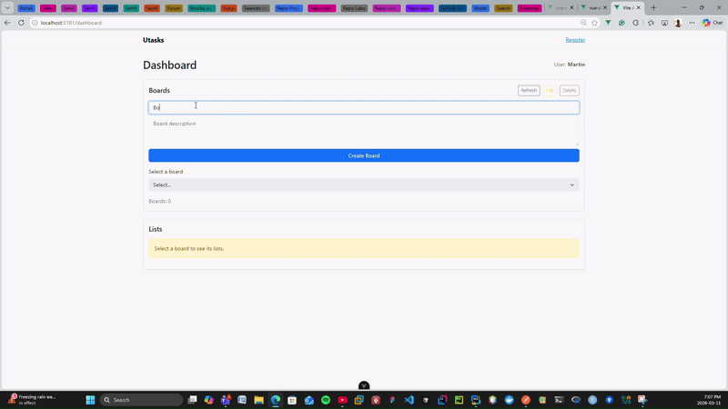
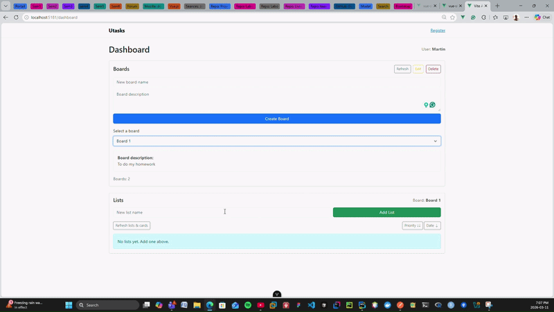
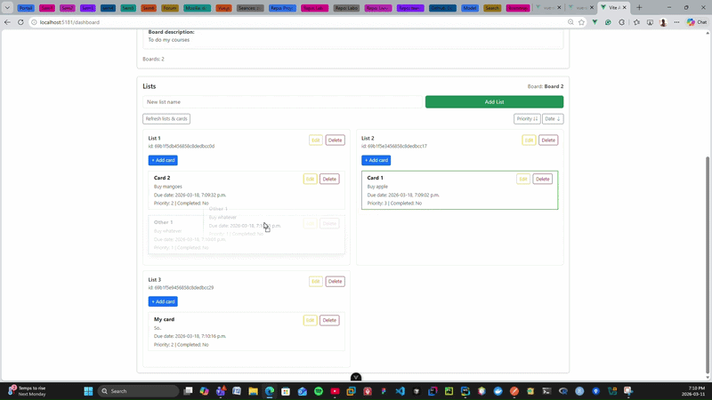

> 🇫🇷 [Lire en français](README.fr.md)

# UTasks — Task Management App

Trello-inspired task management app built as a university project at Laval University. Boards, lists, cards, drag-and-drop, real-time chat — frontend and backend, both from scratch.

> The original course repository is private. This mirror contains only this README.

> 🔗[Full Demo](https://youtu.be/M_y_7DwdNP0)
---

## 📹 Demo
*Board overview*



---

## Features

**Boards, Lists & Cards**<br>
└─ `Create, edit, delete boards, lists, and cards. Full CRUD on all levels.`

**Drag & Drop**<br>
└─ `Reorder cards across lists and reorder lists within a board — smooth and fluid.`

**Card Sorting**<br>
└─ `Sort cards by priority or due date within a list.`

**Authentication**<br>
└─ `User registration, login, logout with token-based auth.`

**Real-Time Chat**<br>
└─ `Live messaging between users via WebSocket.`

---
## 📹 Demo
*Add list in board in action*



*Drag and drop in action*




---

## Tech Stack

**Frontend**
- Vue 3, Vite, Vue Router
- vuedraggable (drag & drop)
- Axios

**Backend**
- Node.js, Express, REST API
- MongoDB, Mongoose
- Passport.js (authentication)
- Socket.io (real-time chat)

---

## Project Structure

```
frontend/
├── main.js
├── App.vue
└── src/
    ├── pages/          # Board, list, card pages
    ├── components/     # Reusable UI components
    ├── router/         # Vue Router config
    └── services/       # Axios API calls
backend/
├── index.js
└── src/
    ├── repositories/   # Data access layer
    ├── services/       # Business logic
    ├── middleware/     # Auth
    ├── socket/         # Socket.io events
    └── scripts/        # Utility scripts
```
---

## My Contributions

**Frontend**
- Drag & drop of cards within and across lists
- Drag & drop reordering of lists within a board
- Card sorting by priority and due date

**Backend**
- Authentication (registration, login, logout, token)
- Real-time chat between users (Socket.io)

---

## Contributors

University team project — GLO-3102, Université Laval.

- **[Petiton Wiseley](https://github.com/pwiseley)**
- **[Ouedraogo Aliya Imann](https://github.com/aioue8)**
- **[Dongmeza Murielle Christelle](https://github.com/muriellec)**
---

[petiton.dev](https://petiton.dev)
